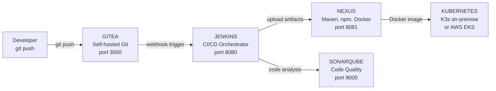

# Complete CI/CD Platform — Gitea → Jenkins → Nexus → SonarQube → Kubernetes

> This is the complete end-to-end picture.
> Code lives in Gitea (your self-hosted Git).
> Jenkins picks up the change and runs the pipeline.
> SonarQube checks code quality.
> Nexus stores artifacts and Docker images.
> Finally: deploy to Kubernetes.
> Every step is real. Every command works.

---

## Platform Architecture



---

## Step 1: Configure Gitea Webhook

```bash
# After Gitea is running (from Section 11 — on-premise setup)
# Configure webhook to trigger Jenkins on push

GITEA_URL="http://192.168.56.20:3000"
REPO_OWNER="devops-team"
REPO_NAME="payment-api"
JENKINS_URL="http://192.168.56.20:8080"
GITEA_TOKEN="your-gitea-admin-token"

# Create webhook via Gitea API
curl -X POST \
  "$GITEA_URL/api/v1/repos/$REPO_OWNER/$REPO_NAME/hooks" \
  -H "Authorization: token $GITEA_TOKEN" \
  -H "Content-Type: application/json" \
  -d '{
    "type": "gitea",
    "config": {
      "url": "'"$JENKINS_URL"'/gitea-webhook/post",
      "content_type": "json",
      "secret": "my-webhook-secret-12345"
    },
    "events": ["push", "pull_request"],
    "active": true
  }'

echo "Webhook created. Test by pushing to the repository."
```

---

## Step 2: Complete Jenkinsfile

```groovy
// Jenkinsfile
// Complete CI/CD pipeline for a Java/Node.js application
// Works with: Gitea, SonarQube, Nexus, Kubernetes

pipeline {
    agent {
        kubernetes {
            yaml '''
apiVersion: v1
kind: Pod
metadata:
  labels:
    app: jenkins-agent
spec:
  containers:
    - name: jnlp
      image: jenkins/inbound-agent:latest
    - name: maven
      image: maven:3.9-eclipse-temurin-21
      command: [cat]
      tty: true
      resources:
        requests:
          memory: "1Gi"
          cpu: "500m"
    - name: docker
      image: docker:24-dind
      securityContext:
        privileged: true
      volumeMounts:
        - name: docker-sock
          mountPath: /var/run/docker.sock
    - name: kubectl
      image: bitnami/kubectl:latest
      command: [cat]
      tty: true
  volumes:
    - name: docker-sock
      hostPath:
        path: /var/run/docker.sock
'''
        }
    }
    
    environment {
        // Nexus settings
        NEXUS_URL        = 'http://192.168.56.20:8081'
        NEXUS_CREDENTIAL = credentials('nexus-credentials')
        
        // Docker image settings
        IMAGE_NAME       = 'payment-api'
        DOCKER_REGISTRY  = '192.168.56.20:5000'  // Nexus Docker registry
        IMAGE_TAG        = "${GIT_BRANCH}-${GIT_COMMIT[0..7]}"
        
        // SonarQube settings
        SONAR_URL        = 'http://192.168.56.20:9000'
        
        // Kubernetes settings
        K8S_NAMESPACE    = 'production'
        K8S_DEPLOYMENT   = "${IMAGE_NAME}"
        
        // Slack notification
        SLACK_CHANNEL    = '#deployments'
    }
    
    options {
        buildDiscarder(logRotator(numToKeepStr: '10'))
        timeout(time: 60, unit: 'MINUTES')
        disableConcurrentBuilds()
        timestamps()
    }
    
    stages {
        // ═══════════════════════════════════
        // STAGE 1: Checkout + Metadata
        // ═══════════════════════════════════
        stage('Checkout') {
            steps {
                checkout scm
                script {
                    env.GIT_COMMIT_MSG = sh(
                        script: 'git log -1 --pretty=%B',
                        returnStdout: true
                    ).trim()
                    env.GIT_AUTHOR = sh(
                        script: 'git log -1 --pretty=%an',
                        returnStdout: true
                    ).trim()
                }
                echo "Branch: ${GIT_BRANCH}"
                echo "Commit: ${GIT_COMMIT[0..7]} by ${GIT_AUTHOR}"
                echo "Message: ${GIT_COMMIT_MSG}"
            }
        }
        
        // ═══════════════════════════════════
        // STAGE 2: Unit Tests
        // ═══════════════════════════════════
        stage('Unit Tests') {
            steps {
                container('maven') {
                    sh '''
                        mvn clean test \
                          -Dmaven.test.failure.ignore=false \
                          -Dsurefire.useFile=false
                    '''
                }
            }
            post {
                always {
                    junit 'target/surefire-reports/*.xml'
                    publishCoverage adapters: [
                        jacocoAdapter('target/site/jacoco/jacoco.xml')
                    ], sourceFileResolver: sourceFiles('STORE_LAST_BUILD')
                }
            }
        }
        
        // ═══════════════════════════════════
        // STAGE 3: SonarQube Analysis
        // ═══════════════════════════════════
        stage('SonarQube Analysis') {
            steps {
                container('maven') {
                    withSonarQubeEnv('SonarQube') {
                        sh '''
                            mvn sonar:sonar \
                              -Dsonar.projectKey=${IMAGE_NAME} \
                              -Dsonar.projectName="${IMAGE_NAME}" \
                              -Dsonar.host.url=${SONAR_URL} \
                              -Dsonar.java.coveragePlugin=jacoco \
                              -Dsonar.coverage.jacoco.xmlReportPaths=target/site/jacoco/jacoco.xml
                        '''
                    }
                }
            }
        }
        
        stage('Quality Gate') {
            steps {
                timeout(time: 5, unit: 'MINUTES') {
                    waitForQualityGate abortPipeline: true
                }
            }
        }
        
        // ═══════════════════════════════════
        // STAGE 4: Build JAR + Upload to Nexus
        // ═══════════════════════════════════
        stage('Build and Publish Artifact') {
            when {
                branch pattern: "main|develop|release/.*", comparator: "REGEXP"
            }
            steps {
                container('maven') {
                    sh '''
                        mvn clean package -DskipTests
                        
                        # Upload to Nexus Maven repository
                        mvn deploy \
                          -DskipTests \
                          -DaltDeploymentRepository=nexus::default::${NEXUS_URL}/repository/maven-releases/
                    '''
                }
            }
        }
        
        // ═══════════════════════════════════
        // STAGE 5: Docker Build + Security Scan
        // ═══════════════════════════════════
        stage('Docker Build') {
            steps {
                container('docker') {
                    sh '''
                        docker build \
                          -t ${DOCKER_REGISTRY}/${IMAGE_NAME}:${IMAGE_TAG} \
                          -t ${DOCKER_REGISTRY}/${IMAGE_NAME}:latest \
                          --build-arg BUILD_NUMBER=${BUILD_NUMBER} \
                          --build-arg GIT_COMMIT=${GIT_COMMIT} \
                          .
                    '''
                }
            }
        }
        
        stage('Container Security Scan') {
            steps {
                container('docker') {
                    sh '''
                        # Install Trivy
                        curl -sfL https://raw.githubusercontent.com/aquasecurity/trivy/main/contrib/install.sh | sh -s -- -b /usr/local/bin
                        
                        # Scan the image
                        trivy image \
                          --severity CRITICAL,HIGH \
                          --exit-code 1 \
                          --format json \
                          --output trivy-report.json \
                          ${DOCKER_REGISTRY}/${IMAGE_NAME}:${IMAGE_TAG}
                    '''
                }
            }
            post {
                always {
                    archiveArtifacts artifacts: 'trivy-report.json', allowEmptyArchive: true
                }
            }
        }
        
        // ═══════════════════════════════════
        // STAGE 6: Push to Nexus Docker Registry
        // ═══════════════════════════════════
        stage('Push Docker Image') {
            when {
                branch pattern: "main|develop|release/.*", comparator: "REGEXP"
            }
            steps {
                container('docker') {
                    sh '''
                        # Login to Nexus Docker registry
                        echo "${NEXUS_CREDENTIAL_PSW}" | \
                          docker login ${DOCKER_REGISTRY} \
                          -u "${NEXUS_CREDENTIAL_USR}" \
                          --password-stdin
                        
                        # Push image
                        docker push ${DOCKER_REGISTRY}/${IMAGE_NAME}:${IMAGE_TAG}
                        
                        if [ "${GIT_BRANCH}" = "main" ]; then
                            docker push ${DOCKER_REGISTRY}/${IMAGE_NAME}:latest
                        fi
                        
                        echo "Image pushed: ${DOCKER_REGISTRY}/${IMAGE_NAME}:${IMAGE_TAG}"
                    '''
                }
            }
        }
        
        // ═══════════════════════════════════
        // STAGE 7: Deploy to Staging
        // ═══════════════════════════════════
        stage('Deploy to Staging') {
            when {
                anyOf {
                    branch 'develop'
                    branch 'main'
                }
            }
            steps {
                container('kubectl') {
                    withKubeConfig([credentialsId: 'k8s-staging-config']) {
                        sh '''
                            # Update image
                            kubectl set image deployment/${K8S_DEPLOYMENT} \
                                ${K8S_DEPLOYMENT}=${DOCKER_REGISTRY}/${IMAGE_NAME}:${IMAGE_TAG} \
                                --namespace staging
                            
                            # Wait for rollout
                            kubectl rollout status deployment/${K8S_DEPLOYMENT} \
                                --namespace staging \
                                --timeout=5m
                            
                            echo "Deployed to staging"
                        '''
                    }
                }
            }
        }
        
        stage('Smoke Test Staging') {
            when {
                anyOf {
                    branch 'develop'
                    branch 'main'
                }
            }
            steps {
                sh '''
                    # Wait for service to be ready
                    sleep 30
                    
                    # Run smoke tests
                    STAGING_URL="http://payment-api.staging.svc.cluster.local:8080"
                    
                    # Health check
                    HTTP_CODE=$(curl -sf -o /dev/null -w "%{http_code}" ${STAGING_URL}/actuator/health)
                    if [ "$HTTP_CODE" != "200" ]; then
                        echo "❌ Staging health check failed: HTTP $HTTP_CODE"
                        exit 1
                    fi
                    
                    echo "✅ Staging smoke tests PASSED"
                '''
            }
        }
        
        // ═══════════════════════════════════
        // STAGE 8: Deploy to Production
        // ═══════════════════════════════════
        stage('Deploy to Production') {
            when {
                branch 'main'
            }
            steps {
                // Manual approval for production deployments
                input message: "Deploy ${IMAGE_NAME}:${IMAGE_TAG} to PRODUCTION?",
                      ok: "Deploy",
                      submitter: "devops-lead,engineering-manager"
                
                container('kubectl') {
                    withKubeConfig([credentialsId: 'k8s-production-config']) {
                        sh '''
                            # Rolling update with zero-downtime
                            kubectl set image deployment/${K8S_DEPLOYMENT} \
                                ${K8S_DEPLOYMENT}=${DOCKER_REGISTRY}/${IMAGE_NAME}:${IMAGE_TAG} \
                                --namespace production
                            
                            # Wait for rollout
                            kubectl rollout status deployment/${K8S_DEPLOYMENT} \
                                --namespace production \
                                --timeout=10m
                            
                            echo "✅ Deployed to production: ${IMAGE_TAG}"
                        '''
                    }
                }
            }
        }
        
        stage('Production Verification') {
            when {
                branch 'main'
            }
            steps {
                sh '''
                    sleep 30
                    
                    PROD_URL="https://api.company.com"
                    
                    # Health check
                    HEALTH=$(curl -sf ${PROD_URL}/actuator/health | jq -r '.status')
                    if [ "$HEALTH" != "UP" ]; then
                        echo "❌ Production health check failed"
                        exit 1
                    fi
                    
                    echo "✅ Production deployment verified"
                '''
            }
        }
    }
    
    post {
        success {
            script {
                def message = """
✅ *Pipeline SUCCESS*
• Job: ${JOB_NAME} #${BUILD_NUMBER}
• Branch: ${GIT_BRANCH}
• Image: ${DOCKER_REGISTRY}/${IMAGE_NAME}:${IMAGE_TAG}
• By: ${GIT_AUTHOR}
• Duration: ${currentBuild.durationString}
                """.stripIndent()
                
                slackSend channel: env.SLACK_CHANNEL,
                          color: 'good',
                          message: message
            }
        }
        
        failure {
            script {
                def message = """
❌ *Pipeline FAILED*
• Job: ${JOB_NAME} #${BUILD_NUMBER}
• Branch: ${GIT_BRANCH}
• Stage: ${currentBuild.currentResult}
• By: ${GIT_AUTHOR}
• Logs: ${BUILD_URL}console
                """.stripIndent()
                
                slackSend channel: env.SLACK_CHANNEL,
                          color: 'danger',
                          message: message
                
                // If production deploy failed, auto-rollback
                if (env.GIT_BRANCH == 'main') {
                    container('kubectl') {
                        withKubeConfig([credentialsId: 'k8s-production-config']) {
                            sh "kubectl rollout undo deployment/${K8S_DEPLOYMENT} --namespace production"
                        }
                    }
                    
                    slackSend channel: env.SLACK_CHANNEL,
                              color: 'warning',
                              message: "🔄 Auto-rollback executed for ${IMAGE_NAME} in production"
                }
            }
        }
        
        always {
            // Clean up Docker images on build agent to save disk space
            container('docker') {
                sh "docker rmi ${DOCKER_REGISTRY}/${IMAGE_NAME}:${IMAGE_TAG} || true"
            }
        }
    }
}
```

---

## Step 3: SonarQube Quality Gates

```bash
#!/bin/bash
# setup-sonarqube-quality-gate.sh
# Create custom quality gate for the project

SONAR_URL="http://192.168.56.20:9000"
SONAR_TOKEN="sqa_your-admin-token"
PROJECT_KEY="payment-api"

echo "Setting up SonarQube Quality Gate..."

# Create quality gate
GATE_ID=$(curl -sf -X POST \
  "$SONAR_URL/api/qualitygates/create" \
  -u "$SONAR_TOKEN:" \
  -d "name=Company%20Standard" | jq -r '.id')

echo "Quality Gate ID: $GATE_ID"

# Add conditions to the quality gate
# Condition 1: Coverage >= 80%
curl -sf -X POST \
  "$SONAR_URL/api/qualitygates/create_condition" \
  -u "$SONAR_TOKEN:" \
  -d "gateId=$GATE_ID&metric=coverage&op=LT&error=80"

# Condition 2: No new critical bugs
curl -sf -X POST \
  "$SONAR_URL/api/qualitygates/create_condition" \
  -u "$SONAR_TOKEN:" \
  -d "gateId=$GATE_ID&metric=new_critical_violations&op=GT&error=0"

# Condition 3: No new critical security vulnerabilities
curl -sf -X POST \
  "$SONAR_URL/api/qualitygates/create_condition" \
  -u "$SONAR_TOKEN:" \
  -d "gateId=$GATE_ID&metric=new_security_hotspots_reviewed&op=LT&error=100"

# Condition 4: Duplicated lines < 5%
curl -sf -X POST \
  "$SONAR_URL/api/qualitygates/create_condition" \
  -u "$SONAR_TOKEN:" \
  -d "gateId=$GATE_ID&metric=new_duplicated_lines_density&op=GT&error=5"

# Assign quality gate to project
curl -sf -X POST \
  "$SONAR_URL/api/qualitygates/select" \
  -u "$SONAR_TOKEN:" \
  -d "gateId=$GATE_ID&projectKey=$PROJECT_KEY"

echo "✅ Quality gate configured for $PROJECT_KEY"
```

---

## Step 4: Nexus Repository Setup

```bash
#!/bin/bash
# setup-nexus-repos.sh
# Create all required repositories in Nexus

NEXUS_URL="http://192.168.56.20:8081"
NEXUS_USER="admin"
NEXUS_PASS="admin123"  # Change in production!

echo "Setting up Nexus repositories..."

# Wait for Nexus to be ready
until curl -sf "$NEXUS_URL/service/rest/v1/status" > /dev/null; do
  echo "Waiting for Nexus..."
  sleep 10
done

# 1. Maven releases
curl -sf -X POST \
  "$NEXUS_URL/service/rest/v1/repositories/maven/hosted" \
  -u "$NEXUS_USER:$NEXUS_PASS" \
  -H "Content-Type: application/json" \
  -d '{
    "name": "maven-releases",
    "online": true,
    "storage": {
      "blobStoreName": "default",
      "strictContentTypeValidation": false,
      "writePolicy": "allow_once"
    },
    "maven": {
      "versionPolicy": "RELEASE",
      "layoutPolicy": "STRICT",
      "contentDisposition": "INLINE"
    }
  }'

# 2. Maven snapshots
curl -sf -X POST \
  "$NEXUS_URL/service/rest/v1/repositories/maven/hosted" \
  -u "$NEXUS_USER:$NEXUS_PASS" \
  -H "Content-Type: application/json" \
  -d '{
    "name": "maven-snapshots",
    "online": true,
    "storage": {
      "blobStoreName": "default",
      "strictContentTypeValidation": false,
      "writePolicy": "allow"
    },
    "maven": {
      "versionPolicy": "SNAPSHOT",
      "layoutPolicy": "STRICT",
      "contentDisposition": "INLINE"
    }
  }'

# 3. npm registry
curl -sf -X POST \
  "$NEXUS_URL/service/rest/v1/repositories/npm/hosted" \
  -u "$NEXUS_USER:$NEXUS_PASS" \
  -H "Content-Type: application/json" \
  -d '{
    "name": "npm-releases",
    "online": true,
    "storage": {
      "blobStoreName": "default",
      "strictContentTypeValidation": true,
      "writePolicy": "allow_once"
    }
  }'

# 4. Docker registry (port 5000)
curl -sf -X POST \
  "$NEXUS_URL/service/rest/v1/repositories/docker/hosted" \
  -u "$NEXUS_USER:$NEXUS_PASS" \
  -H "Content-Type: application/json" \
  -d '{
    "name": "docker-releases",
    "online": true,
    "storage": {
      "blobStoreName": "default",
      "strictContentTypeValidation": true,
      "writePolicy": "allow"
    },
    "docker": {
      "v1Enabled": false,
      "forceBasicAuth": true,
      "httpPort": 5000
    }
  }'

# 5. Maven proxy (for fetching from Maven Central)
curl -sf -X POST \
  "$NEXUS_URL/service/rest/v1/repositories/maven/proxy" \
  -u "$NEXUS_USER:$NEXUS_PASS" \
  -H "Content-Type: application/json" \
  -d '{
    "name": "maven-central",
    "online": true,
    "storage": {
      "blobStoreName": "default",
      "strictContentTypeValidation": false
    },
    "proxy": {
      "remoteUrl": "https://repo1.maven.org/maven2/",
      "contentMaxAge": 1440,
      "metadataMaxAge": 1440
    },
    "maven": {
      "versionPolicy": "RELEASE",
      "layoutPolicy": "PERMISSIVE"
    }
  }'

echo "✅ Nexus repositories configured"
echo ""
echo "Repository URLs:"
echo "  Maven releases:   $NEXUS_URL/repository/maven-releases/"
echo "  Maven snapshots:  $NEXUS_URL/repository/maven-snapshots/"
echo "  Docker registry:  $(hostname -I | awk '{print $1}'):5000"
```

---

## Step 5: Connect Kubernetes to Nexus (Pull Secret)

```bash
#!/bin/bash
# setup-k8s-nexus-pull-secret.sh
# Allow Kubernetes to pull images from Nexus Docker registry

NEXUS_REGISTRY="192.168.56.20:5000"
NEXUS_USER="admin"
NEXUS_PASS="admin123"
NAMESPACE="production"

# Create image pull secret
kubectl create secret docker-registry nexus-registry \
  --docker-server=$NEXUS_REGISTRY \
  --docker-username=$NEXUS_USER \
  --docker-password=$NEXUS_PASS \
  --namespace $NAMESPACE

# Patch default service account to use this secret
kubectl patch serviceaccount default \
  -p '{"imagePullSecrets": [{"name": "nexus-registry"}]}' \
  --namespace $NAMESPACE

echo "✅ Kubernetes configured to pull from Nexus"
echo ""
echo "To use in a pod:"
echo "  image: $NEXUS_REGISTRY/payment-api:v1.0.0"
```

---

## Full End-to-End Test

```bash
#!/bin/bash
# e2e-test.sh
# Test the complete CI/CD pipeline end-to-end

echo "=== End-to-End CI/CD Platform Test ==="

GITEA_URL="http://192.168.56.20:3000"
JENKINS_URL="http://192.168.56.20:8080"
NEXUS_URL="http://192.168.56.20:8081"
SONAR_URL="http://192.168.56.20:9000"

# 1. Check all services are up
echo ""
echo "--- Service Health Checks ---"

for service in \
  "Gitea:$GITEA_URL" \
  "Jenkins:$JENKINS_URL" \
  "Nexus:$NEXUS_URL" \
  "SonarQube:$SONAR_URL"; do
  
  NAME=$(echo $service | cut -d: -f1)
  URL=$(echo $service | cut -d: -f2-3)
  
  HTTP_CODE=$(curl -sf -o /dev/null -w "%{http_code}" "$URL" 2>/dev/null || echo "000")
  if [[ "$HTTP_CODE" =~ ^(200|401|302)$ ]]; then
    echo "✅ $NAME: UP ($URL)"
  else
    echo "❌ $NAME: DOWN ($URL) - HTTP $HTTP_CODE"
  fi
done

# 2. Check Kubernetes
echo ""
echo "--- Kubernetes Health ---"
kubectl get nodes
kubectl get pods -n production --no-headers | \
  awk '{print "  " $1 ": " $3}' | \
  sed 's/Running/✅ Running/g' | \
  sed 's/Error/❌ Error/g' | \
  sed 's/CrashLoopBackOff/❌ CrashLoopBackOff/g'

# 3. Trigger a test pipeline (commit a small change)
echo ""
echo "--- Trigger Test Pipeline ---"
echo "Creating test commit in Gitea..."
# In a real test, you would make a real git push here

echo ""
echo "Test pipeline URL: $JENKINS_URL/job/payment-api/"
echo ""
echo "Pipeline stages:"
echo "  1. Checkout"
echo "  2. Unit Tests → target/surefire-reports/"
echo "  3. SonarQube → $SONAR_URL/dashboard?id=payment-api"
echo "  4. Quality Gate → must pass to continue"
echo "  5. Maven Build → JAR in target/"
echo "  6. Docker Build → image built"
echo "  7. Trivy Scan → no CRITICAL vulnerabilities"
echo "  8. Push → $NEXUS_URL (docker registry port 5000)"
echo "  9. Deploy Staging → kubectl apply"
echo " 10. Smoke Test → /actuator/health"
echo " 11. Deploy Prod → manual approval required"
```

---

## Interview Questions — CI/CD Platform

**Q: How do you handle secrets in a Jenkins pipeline?**
```
NEVER put secrets in Jenkinsfile or environment variables as plain text.

3-tier approach:

1. Jenkins Credentials Store (for pipeline secrets):
   - Nexus password, SonarQube token, kubeconfig
   - Reference in Jenkinsfile: credentials('my-secret-id')
   - Stored encrypted in Jenkins (JCASC manages them as code)

2. Kubernetes Secrets (for app secrets):
   - Database passwords, API keys
   - NEVER stored in deployment YAML (git)
   - External Secrets Operator pulls from AWS Secrets Manager

3. AWS Secrets Manager / Vault (the real source of truth):
   - All production secrets live here
   - Jenkins uses AWS IRSA role to access secrets manager
   - Rotation is managed here (rotated without code change)

What you NEVER do:
  ❌ echo "DB_PASS=mysecret123" > .env
  ❌ SECRET_TOKEN = "sk-abc123" in Jenkinsfile
  ❌ Docker build --build-arg API_KEY=secret
     (visible in docker history)
```

**Q: What happens if the production deployment fails mid-rollout?**
```
Kubernetes RollingUpdate: if new pods fail to become Ready:
  → RollingUpdate stops (won't continue to next pod)
  → Old pods continue serving traffic
  → You have a partially-updated state (some old, some new pods)

Recovery options:
1. Auto-rollback (our pipeline does this):
   kubectl rollout undo deployment/payment-api
   → Goes back to previous stable version instantly
   → Takes 1-2 minutes

2. Manual investigation:
   kubectl rollout status deployment/payment-api
   kubectl describe pod payment-api-newpod-xyz
   kubectl logs payment-api-newpod-xyz

3. Pause and fix:
   kubectl rollout pause deployment/payment-api
   → Fix the issue
   kubectl rollout resume deployment/payment-api

Prevention (better than recovery):
  → Canary deployment: test on 10% traffic before 100%
  → Readiness probe: Kubernetes won't route traffic until app is ready
  → Smoke tests: verify staging before approving production
  → Feature flags: deploy code "off", turn on after deploy succeeds
```

---

[← Kubernetes Production](./04-kubernetes-production.md) | [Next: Full Observability →](./06-full-observability.md)
