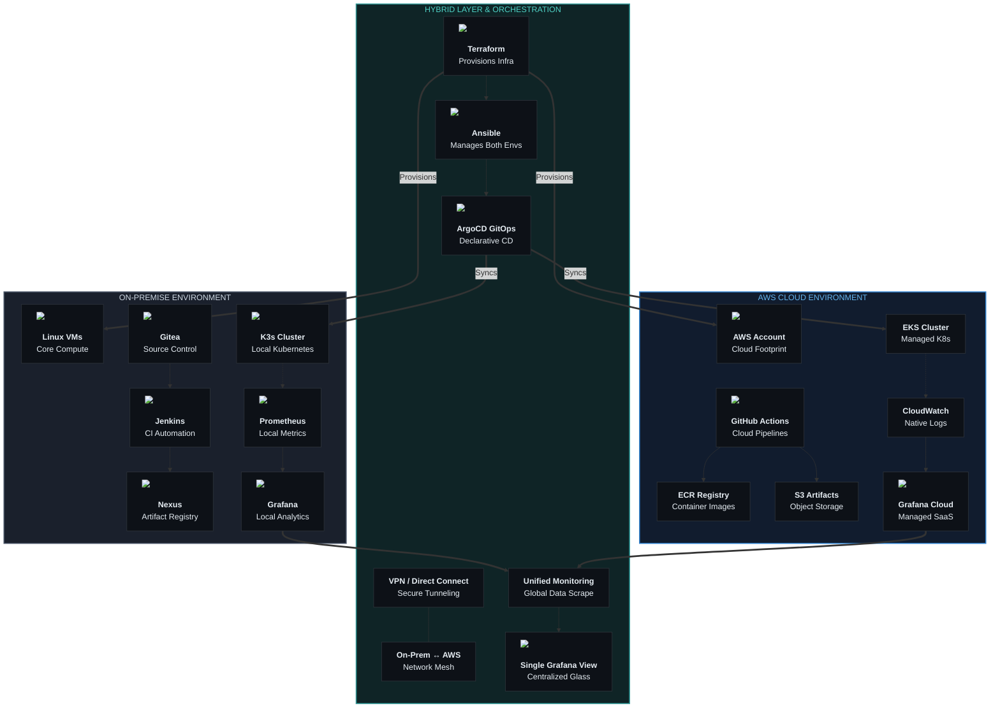

# Section 11 — Infrastructure from Zero to Expert

> This section is 100% practical.
> You will build a complete DevOps platform from scratch.
> Every command is real. Every script is complete. Every step is explained.

---

## What You Will Build

By the end of this section, you have a production-ready DevOps platform:



---

## Topics in This Section

| File | Topic | Time |
|------|-------|------|
| [Onpremise from zero](javascript:dvGo('onpremise-from-zero')) | Build on-premise DevOps platform | 2–3 hours |
| [Cloud from zero](javascript:dvGo('cloud-from-zero')) | Build AWS cloud platform from scratch | 2–3 hours |
| [Hybrid setup](javascript:dvGo('hybrid-setup')) | Connect on-premise to cloud | 1–2 hours |
| [Kubernetes production](javascript:dvGo('kubernetes-production')) | Production-grade Kubernetes | 2 hours |
| [Complete CI/CD platform](javascript:dvGo('complete-cicd-platform')) | Jenkins + Nexus + SonarQube + Slack | 2 hours |
| [Full Observability](javascript:dvGo('full-observability')) | Prometheus + Grafana + Loki + Alerting | 2 hours |

---

## Before You Start

### Hardware Requirements

```
On-premise lab (minimum):
  1 server or VM with 8 CPU cores, 16GB RAM, 200GB SSD
  → We will create multiple VMs with Vagrant + VirtualBox

Cloud (free tier):
  AWS account (free tier covers most of this)
  GitHub account (free)
```

### Software to Install on Your Workstation

```bash
# Windows workstation — install these tools:
# 1. WSL2 (Windows Subsystem for Linux)
wsl --install -d Ubuntu

# 2. VirtualBox (for local VMs)
# Download: virtualbox.org

# 3. Vagrant (VM automation)
# Download: vagrantup.com

# 4. kubectl
# Download: kubernetes.io/docs/tasks/tools/install-kubectl-windows/

# 5. Helm
# Download: helm.sh/docs/intro/install/

# 6. Terraform
# Download: developer.hashicorp.com/terraform/install

# 7. AWS CLI v2
# Download: aws.amazon.com/cli/

# 8. VS Code + alpaquitay-ai extension
# + GitLens, Kubernetes extension, Terraform extension
```

---

[← Back to Main](/) | [Next: Compliance →](/compliance/)
